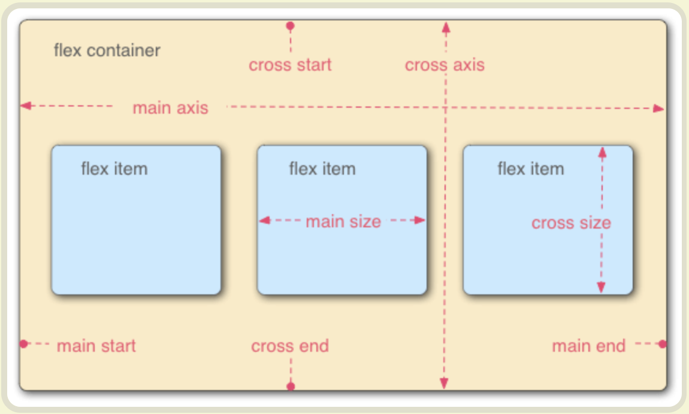

# 说明：

## 概述

1. Flex布局是CSS3新增的一种布局方式，可以简化布局的复杂度，使得页面的布局更加灵活。
2. Flex布局的属性：display: flex; flex-direction: row | row-reverse | column | column-reverse; justify-content:
   flex-start | flex-end | center | space-between | space-around; align-items: flex-start | flex-end | center |
   baseline | stretch; align-content: flex-start | flex-end | center | space-between | space-around;

## 基本概念与说明

1. Flex布局的基本概念：容器（container）、项目（item）、主轴（main axis）、交叉轴（cross axis）。
2. 容器：指的是Flex布局的父元素，也就是`display: flex;`的元素。
3. 项目：指的是被放入Flex布局的子元素，也就是`display: block;`的元素。
4. 主轴：Flex布局的默认主轴为水平方向，即从左向右。
5. 交叉轴：Flex布局的默认交叉轴为垂直方向，即从上到下。
6. 主轴的方向：可以通过flex-direction属性设置主轴的方向，可选值有row（默认）、row-reverse、column、column-reverse。
7. 项目的排列：可以通过justify-content属性设置项目在主轴上的排列方式，可选值有flex-start（默认）、flex-end、center、space-between、space-around。
8. 项目的对齐：可以通过align-items属性设置项目在交叉轴上的对齐方式，可选值有flex-start、flex-end、center、baseline、stretch（默认）。
9. 多行项目的对齐：可以通过align-content属性设置多行项目在交叉轴上的对齐方式，可选值有flex-start、flex-end、center、space-between、space-around。

▌参考：https://zhuanlan.zhihu.com/p/6337316318
