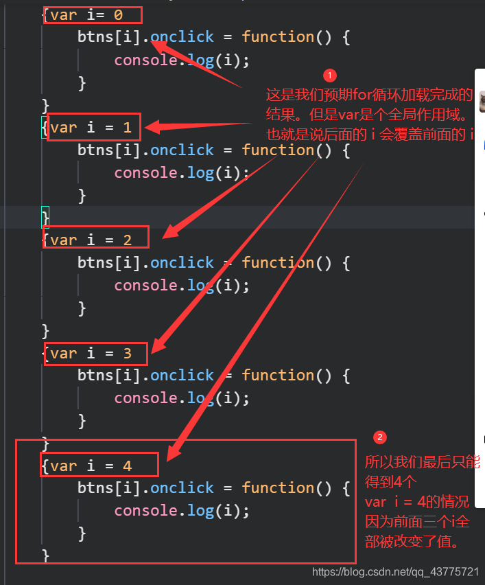

说明：
===

JavaScript体系里的代码可以分为两类：

- 同步代码：指在主线程上排队执行的代码，只有前一个代码执行完毕，才能执行后一个代码。
- 异步代码：指不进入主线程、而进入"任务队列"（task queue）的代码。只有"任务队列"通知主线程，某个异步任务可以执行了，该任务才会进入主线程执行。

缺省情形下，我们写的JavaScript代码都是同步代码，也就是说都是进入主线程，按照顺序执行各个同步代码。
但我们为某个元素写的onclick事件处理方法是一个异步的方法。因为挂接事件和执行事件，是两个不同的操作，它们之间是异步的。
挂接事件是同步的，而事件触发是需要等待用户点击的，是异步的。（也就是说有需要和终端用户交互的代码逻辑是需要通过异步来保障的。）

针对本示例：

1. 使用for和var的时候，var会为每个循环都声明一个变量，导致声明的变量名相同，从而覆盖前面的值。

   

2. 使用let的时候，let声明的变量，在块级作用域内有效。（for...let循环后的结构跟for...var相同，只是let定义的变量为块级作用域）

|参考资料：https://blog.csdn.net/a1071626267/article/details/125414162
